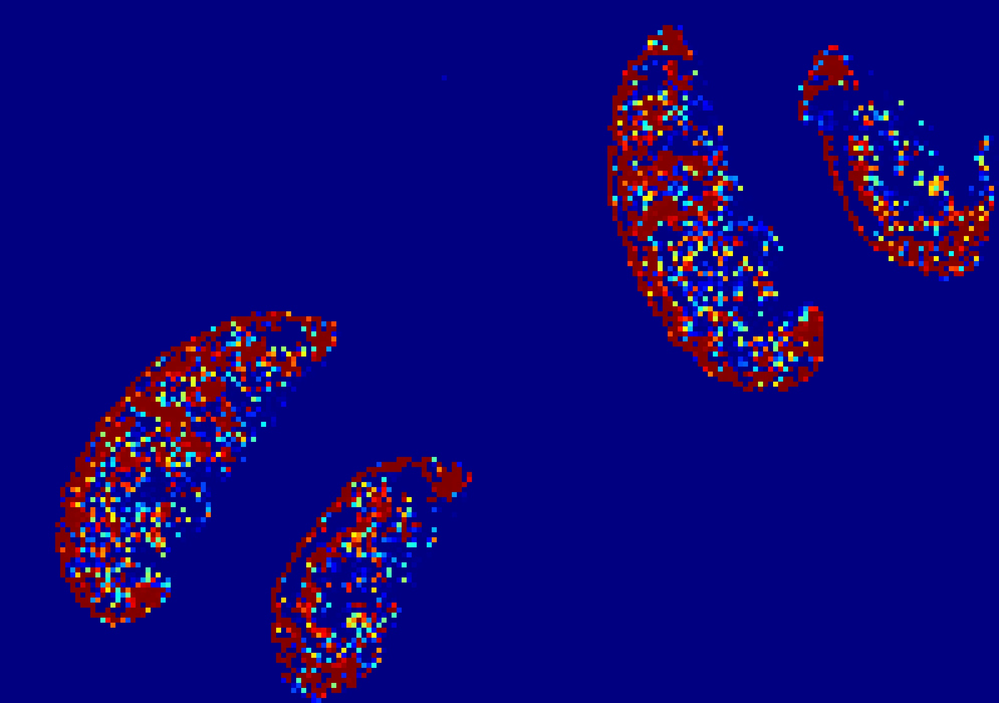

# HistoHelper: Clinical Machine Learning Pipeline

This directory contains the data engineering, PyTorch training infrastructure, and FastAPI inference engine that power HistoHelper AI.



## Core Architecture

* **Transfer Learning:** Utilises `ResNet18` (via `torchvision.models`), decapitating the final fully connected layer and replacing it with a custom binary classifier (Benign vs. Malignant) with a 50% dropout rate to prevent overfitting.
* **Hardware Acceleration:** The training scripts are written to dynamically detect and utilise Apple Silicon's Metal Performance Shaders (`mps`) for high-speed local GPU training.
* **Explainable AI (XAI):** Implements a custom `HistoGradCAM` class that registers forward/backward hooks into ResNet18's terminal convolutional layer (`layer4[-1]`), generating spatial heatmaps to prove the model is diagnosing based on cellular morphology, not background noise.

## File Structure

```text
├── assets/                  # High-res WSI heatmaps, overlays, and clinical matrices
├── tcga/                    # Patient clinical metadata (Metastasis labels)
├── src/                     # Core application & ML source code
│   ├── api.py               # FastAPI inference server
│   ├── attention_net.py     # Multimodal AB-MIL PyTorch architecture
│   ├── dataset_loader.py    # Standardisation & morphological augmentation
│   ├── evaluate_model.py    # Clinical evaluation suite (PR-AUC, F1, Matrix)
│   ├── gradcam.py           # Explainable AI hook registration
│   ├── model.py             # Feature extractor backbone
│   └── train.py             # Training loop with early stopping
├── Dockerfile               # Containerisation configuration
├── docker-compose.yml       # Local orchestration
├── requirements.txt         # Python dependencies
└── README.md                # Project documentation
```

### 1. Data Engineering & Ingestion
* `fetch_api_labels.py`: Bypasses the 250GB Hugging Face archive download by hitting the Datasets Server API to reconstruct clinical metadata for locally downloaded patches.
* `dataset_loader.py`: A custom PyTorch `Dataset` and `DataLoader` pipeline. It handles ImageNet standardisation, morphological augmentations (rotations, flips, color jitter), and applies a `WeightedRandomSampler` to correct for class imbalances during training.
* `mvp_tiler.py`: Uses `OpenSlide` and `OpenCV` Otsu's Thresholding to dynamically segment gigapixel `.svs` Whole Slide Images, extracting high-res 224x224 tissue patches while discarding 100% of blank glass.

### 2. Training & Evaluation
* `train.py`: The V2 production training loop. Features a `ReduceLROnPlateau` scheduler and strict early-stopping logic that monitors Validation Loss to save the optimal `histohelper_production.pth` weights before the model overfits.
* `evaluate_model.py`: A clinical evaluation suite that forces the model to diagnose a 20% holdout set of unseen patches, bypassing raw accuracy to calculate Sensitivity (Recall), Specificity, and plot a publication-ready Confusion Matrix.

### 3. Inference & API
* `api.py`: An asynchronous FastAPI server (`uvicorn`) designed to be containerised. It exposes a `/predict` endpoint that ingests client imagery, runs the PyTorch inference, overlays the OpenCV Grad-CAM heatmap, and returns a Base64-encoded clinical payload.
* `wsi_inference.py`: A batched inference script that pushes thousands of extracted WSI patches through the model simultaneously, stitching the predicted probabilities back into their original spatial coordinates to render a macroscopic WSI heatmap.

## Running the API Locally
To spin up the inference engine for local frontend development:

```bash
# 1. Install dependencies
pip install -r requirements.txt

# 2. Boot the FastAPI server on port 8000
python3 api.py
```